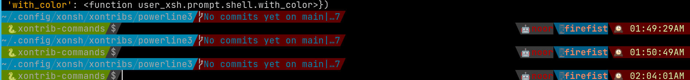

# Powerline3
Yet another powerline theme for xonsh with async prompt support. 

## Why another one?

- It uses `$PROMPT_FIELDS` and no need to have a separate functions and renderer. 
  Since the addition of `$PROMPT_TOKENS_FORMATTER` it is possible to use the existing 
  set of functions to emulate powerline theme for xonsh prompts.
- Async prompt mode works as well. 

## Installation

To install use pip:

``` bash
xpip install xontrib-powerline3
# or: xpip install -U git+https://github.com/jnoortheen/xontrib-powerline3
```

## Usage

``` bash
xontrib load powerline3

# update the default set of colors for 
# the fields by updating the env variable
$PROMPT_FIELD_COLORS = {
    "cwd": ("WHITE", "CYAN"),
    "gitstatus": ("WHITE", "BLACK"),
    "ret_code": ("WHITE", "RED"),
    "full_env_name": ("white", "green"),
    "hostname": ("white", BLUE),
    "localtime": ("#DAF7A6", "black"),
}

# choose the powerline glyph used
$POWERLINE_MODE = "powerline" 
# Other choices are 
# round/down/up/flame/squares/ruiny/lego
# by default it chooses at radom
```

## Examples



## Credits

This package was created with [xontrib cookiecutter template](https://github.com/jnoortheen/xontrib-cookiecutter).
- https://www.nerdfonts.com/cheat-sheet?set=nf-ple-
- https://github.com/romkatv/powerlevel10k#meslo-nerd-font-patched-for-powerlevel10k

## Similar Projects
- https://github.com/vaaaaanquish/xontrib-powerline2
- https://github.com/santagada/xontrib-powerline
  
