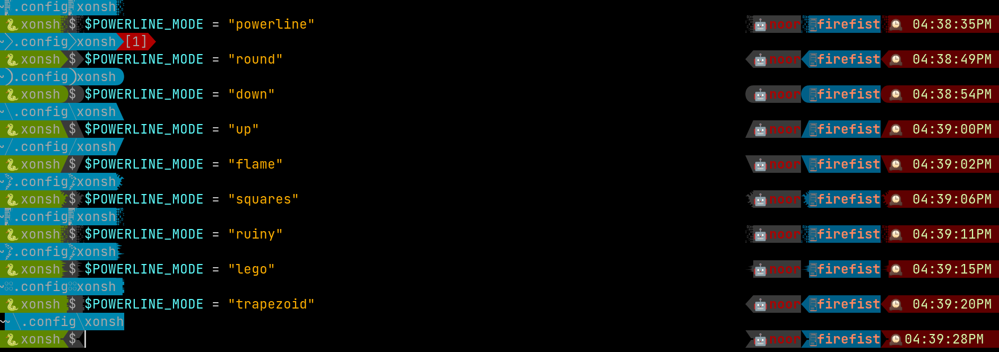

# Powerline3
Yet another powerline theme for xonsh with async prompt support. 

# Note: 
This depends on xonsh's unreleased version (master branch will work. or in future >0.9.24)

## Why another one?

- It uses `$PROMPT_FIELDS` and no need to have a separate functions and renderer. 
  Since the addition of `$PROMPT_TOKENS_FORMATTER` it is possible to use the existing 
  set of functions to emulate powerline theme for xonsh prompts.
- Async prompt mode works as well. 

## Installation

To install use pip:

``` bash
xpip install xontrib-powerline3
# or: xpip install -U git+https://github.com/jnoortheen/xontrib-powerline3
```

## Usage

``` xsh
xontrib load powerline3 prompt_ret_code

# the foreground/background colors of the prompt-fields can be configured as below. 
# This works for custom fields as well
# The format is `<prompt-field-name>__pl_colors`. It can be a function returning `tuple[str, str]`
# or set tuples directly as below.
$PROMPT_FIELDS["cwd__pl_colors"] = ("WHITE", "CYAN")

# choose the powerline glyph used
$POWERLINE_MODE = "powerline" # if not set then it will choose random
# available modes: round/down/up/flame/squares/ruiny/lego

# define the prompts using the format style and you are good to go
$PROMPT = "".join(
    [
        "{vte_new_tab_cwd}",
        "{cwd:{}}",
        "{gitstatus:{}}",
        "{ret_code}",
        "{background_jobs}",
        os.linesep,
        "{full_env_name: 🐍{}}",
        "$",
    ]
)
$RIGHT_PROMPT = "".join(
    (
        "{long_cmd_duration: ⌛{}}",
        "{user: 🤖{}}",
        "{hostname: 🖥{}}",
        "{localtime: 🕰{}}",
    )
)
```

## Extra PROMPT_FIELDS

### 1. `full_env_name`

- When the `env_name` 
  - is `.venv` show the name of the parent folder
  - contains `-py3.*` (when it is poetry created) shows the project name part alone
  
### 2. `background_jobs`
- show number of running background jobs


## Examples



## Credits

This package was created with [xontrib cookiecutter template](https://github.com/jnoortheen/xontrib-cookiecutter).
- https://www.nerdfonts.com/cheat-sheet?set=nf-ple-
- https://github.com/romkatv/powerlevel10k#meslo-nerd-font-patched-for-powerlevel10k

## Similar Projects
- https://github.com/vaaaaanquish/xontrib-powerline2
- https://github.com/santagada/xontrib-powerline
